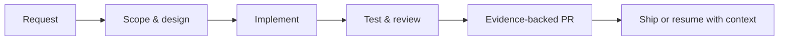
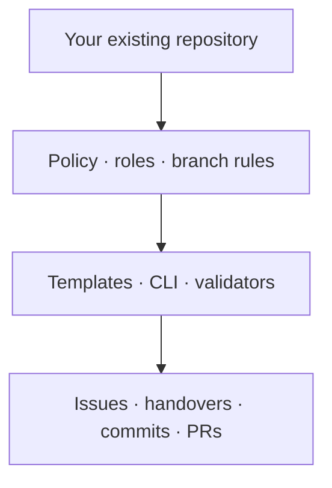

<div align="center">
  
  <br />
  
  <h1>AgentFlow SDLC</h1>
  <p><strong>Turn AI-assisted coding into reviewable, resumable software delivery.</strong></p>
  <p>
    <a href="LICENSE"></a>
    <a href="https://github.com/smota/agentflow-sdlc/stargazers"></a>
    <a href="https://github.com/smota/agentflow-sdlc/releases/latest"></a>
    <a href="https://github.com/smota/agentflow-sdlc/actions/workflows/validate-pr.yml"></a>
    
  </p>
</div>

AgentFlow SDLC is an open-source process layer for software projects that use AI coding agents. It keeps requirements, decisions, validation, review, and handoffs visible in GitHub instead of trapped in one chat session.

It adds delivery governance around your existing repository. It does **not** generate an application, replace GitHub, or dictate your technology stack.

## Understand it in 30 seconds

| Question                        | Answer                                                                                                                                                                                                 |
| ------------------------------- | ------------------------------------------------------------------------------------------------------------------------------------------------------------------------------------------------------ |
| **What is it?**                 | A role-based path from request to pull request, backed by templates, validators, and durable evidence.                                                                                                 |
| **What problem does it solve?** | AI can produce code faster than teams can understand, review, resume, and govern the work around it.                                                                                                   |
| **What is the value?**          | Clear scope, reproducible checks, explicit review boundaries, safer handoffs, and less process memory.                                                                                                 |
| **Who is it for?**              | Solo maintainers and teams using AI coding agents in GitHub-based delivery. Agy, Claude, Codex, and Pi have built-in routing; other registered platforms can still provide truthful evidence identity. |

The safest first look is read-only:

```bash
git clone https://github.com/smota/agentflow-sdlc.git
cd agentflow-sdlc
pnpm install
node bin/cli.mjs onboarding-prompt --target /path/to/your-project
```

The last command prints an assistant-ready onboarding prompt. It does not change the target project. Ready to continue? Follow [Get started](docs/get-started.md), or give your assistant the [assisted onboarding guide](docs/assisted-onboarding.md).

## How it works



One accountable executor normally carries the work through explicit roles. Focused advisers or routed agents are optional when they improve a decision; sensitive work retains human approval.



## What is available now

| Capability                                | What it provides                                                                          | Where to start                                              |
| ----------------------------------------- | ----------------------------------------------------------------------------------------- | ----------------------------------------------------------- |
| Assisted adoption and updates             | Read-only inspection first, approval before writes, lockfile-aware sync                   | [Get started](docs/get-started.md)                          |
| Role-based delivery                       | Analyst through PR-readiness phases with explicit handoffs                                | [Workflow](docs/agent-workflow.md)                          |
| Durable evidence                          | Portable artifact references, transition envelopes, lifecycle boundaries, and PR evidence | [Evidence contracts](docs/evidence-contracts.md)            |
| Deterministic validation                  | Issue, config, role-pass, PR, release, skill, agent, evidence, lifecycle, and eval checks | [CLI reference](docs/index.md#cli-and-validation-reference) |
| Intelligent collaboration                 | Single-agent default plus bounded advisory, discovery, spike, and human-gated modes       | [Collaboration](docs/intelligent-collaboration.md)          |
| Runtime identity and routing              | Truthful platform attribution separated from execution target and transport               | [Runtime platforms](docs/runtime-platforms.md)              |
| Skills, plugins, settings, and extensions | Portable skills plus project-selected overlays and harness adapters                       | [Extension packs](docs/extension-packs.md)                  |
| Optional visual operations                | Cockpit goal, readiness, release, replay, approval, and follow-up views                   | [Cockpit](docs/cockpit.md)                                  |
| Executable quality model                  | Agent eval manifests, multi-agent acceptance checks, and derived outcome metrics          | [Agent evals](docs/agent-evals.md)                          |

### Release status

The current development source is version **1.0.0** and requires Node.js 20 or newer. It is not yet the latest published release. The latest published GitHub release is [v0.7.0](https://github.com/smota/agentflow-sdlc/releases/tag/v0.7.0), and no `agentflow-sdlc` package is currently published on npm. Use the source-based setup above; the release badge always resolves to the newest published release.

## Choose your path

| I want to…                              | Read this                                                     |
| --------------------------------------- | ------------------------------------------------------------- |
| Evaluate the product quickly            | [AgentFlow in 5 minutes](docs/agentflow-in-5-minutes.md)      |
| Adopt it in a repository                | [Get started](docs/get-started.md)                            |
| Find the right guide for my role        | [Start here](docs/start-here.md)                              |
| Understand every document and tool      | [Documentation index](docs/index.md)                          |
| Configure branches, checks, and routing | [Project setup](docs/project-setup.md)                        |
| Run or contribute issue work            | [Contribution workflow](docs/guides/contribution-workflow.md) |
| Extend or integrate the framework       | [SDLC packaging](docs/sdlc-packaging.md)                      |

## Core principles

- Durable evidence over private chat memory.
- One accountable executor by default; more intelligence only when it improves a decision.
- Humans and agents follow the same public contribution contract.
- Human authority for high-assurance work.
- Follow-up issues instead of hidden TODOs or silent scope drift.
- Generated harness adapters are distribution surfaces, not the source of product truth.

## Repository layout

| Area               | Contents                                                                        |
| ------------------ | ------------------------------------------------------------------------------- |
| Policy             | `AGENTS.md` and executor adapters such as `CODEX.md`, `CLAUDE.md`, and `AGY.md` |
| Workflow           | `agents/roles/`, `agents/workflows/`, and `agents/templates/`                   |
| Documentation      | `docs/`, organized by audience in the [documentation index](docs/index.md)      |
| CLI and validators | `bin/`, `scripts/`, `lib/`, and `schemas/`                                      |
| Distribution       | `adapters/`, `skills/`, `extensions/`, and `manifests/`                         |
| Optional interface | Cockpit assets and runtime commands                                             |

## Contributing

Start from a GitHub issue or explicit maintainer direction. Read [`AGENTS.md`](AGENTS.md) first, then follow the [contribution workflow](docs/guides/contribution-workflow.md). Keep changes issue-scoped, run the relevant validators, and use the project PR manifest.

## License

Licensed under the [Apache License 2.0](LICENSE).
