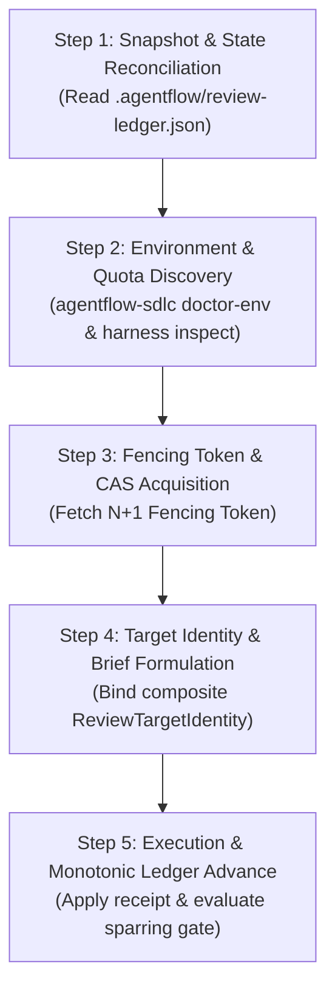

# In-Flight Plan Takeover Playbook

This playbook defines the standardized **5-Step In-Flight Takeover Protocol** for agents and engineers picking up work that was partially executed by another harness, interrupted by rate/quota exhaustion, or transitioning between platforms (e.g., Antigravity $\leftrightarrow$ Claude Code $\leftrightarrow$ Codex CLI).

---

## Why this protocol exists

Real-world autonomous software delivery frequently encounters harness disruptions:

- Weekly or daily rate limit resets (e.g., Claude Opus quota exhaustion).
- Session boundaries or IDE restarts.
- Platform migration where architecture was planned in one harness and implementation takes place in another.

Rather than restarting from scratch or guessing what prior sessions did, this protocol uses the **Cumulative Snapshot Ledger** (`.agentflow/review-ledger.json`) and **Review Target Identity** to safely resume and advance work at any point in the cycle.

---

## The 5-Step Takeover Protocol



### Step 1: Snapshot & State Reconciliation

1. Inspect the target repository root:
   ```bash
   node bin/cli.mjs harness inspect
   ```
2. Locate the resolution ledger (default: `.agentflow/review-ledger.json`).
3. Extract:
   - Current Cycle (e.g., `C-02`)
   - Current Round (e.g., `Round 3`)
   - Last Fencing Token
   - Open Blockers (`[B]`) and Structural (`[S]`) findings
4. Check whether the workspace working tree matches the ledger's `targetIdentityDigest`.

### Step 2: Environment & Quota Discovery

1. Check available local tools and CLI runners:
   ```bash
   node bin/cli.mjs doctor-env
   ```
2. Inspect configured execution policies in `.agentflow/execution-policy.json` and model catalogs in `.agentflow/model-catalog.json`.
3. If an external CLI (`codex-cli` or `claude-cli`) is unavailable or quota-exhausted:
   - Check the fallback cascade: `external-cli` $\to$ `inner-subagent` $\to$ `human-gate`.
   - If running as an inner subagent (Mode B), prepare to record `delegationTopology: "child-subagent"` and `independenceClassification: "same-harness-child"`.

### Step 3: Fencing Token & CAS Acquisition

1. Read the latest `fencingToken` ($F_{current}$) from the ledger.
2. Note the `expectedLedgerRevision` for optimistic concurrency control (Compare-And-Swap).
3. Assign the new operation $F_{next} = F_{current} + 1$.
   > [!IMPORTANT]
   > Any update submitted with a fencing token $\le F_{current}$ will be rejected with `FENCING_TOKEN_STALE` to prevent zombie sessions or interrupted background jobs from overwriting newer progress.

### Step 4: Target Identity & Sparring Brief Formulation

1. Assemble the composite `ReviewTargetIdentity`:
   - `workItemId`: Issue or Task ID
   - `cycle`: Current execution cycle
   - `contractDigest`: SHA-256 of the acceptance contract
   - `sliceManifestDigest`: SHA-256 of modified source files / git diff
   - `policyDigest`: SHA-256 of governance policy
2. If executing a sparring round, generate the sparring brief:
   ```bash
   node scripts/validate-sparring-gate.mjs --brief --objective "Pre-Code Architecture Sparring" --contract-slice "<contract-text>"
   ```
   Or instantiate `agents/templates/sparring-brief.md` including any unresolved findings from the ledger.

### Step 5: Execution & Monotonic Gate Advancement

1. Execute the slice or sparring review round.
2. Ensure the reviewer generates a valid JSON receipt conforming to `schemas/review-round-receipt.schema.json`.
3. Apply the receipt to the ledger:
   ```bash
   node scripts/validate-sparring-gate.mjs --apply --ledger .agentflow/review-ledger.json --receipt <receipt.json>
   ```
4. Evaluate gate clearance:
   ```bash
   node scripts/validate-sparring-gate.mjs --ledger .agentflow/review-ledger.json
   ```
5. When the gate evaluates to `UNLOCKED (PASS)` (all blockers closed or waived, status approved, and target identity matches), advance to the next role phase or commit the completed slice.
