# AgentFlow SDLC in 5 minutes

AgentFlow SDLC is an open-source process layer for AI-assisted software delivery. It helps teams turn fast but opaque AI coding sessions into work that is understandable, reviewable, resumable, and safe to ship through GitHub.

## The problem it solves

AI assistants can produce code quickly, but the surrounding delivery questions still matter:

- What was requested, and what was intentionally out of scope?
- Which architecture or product decisions were made?
- What validation actually ran?
- Was review independent, self-review, or human approval-gated?
- Where does a later person or agent resume if the session ends?

Without a system, those answers stay trapped in chat history. AgentFlow moves them into durable project evidence: issues, handover comments, PR bodies, commits, and validators.

## The one-sentence model

AgentFlow SDLC adds role-based workflow phases, GitHub evidence contracts, and local validators around your existing repository so humans and agents follow the same delivery rules.

## The lifecycle

```mermaid
flowchart LR
  Request["Request or GitHub issue"] --> Analyze["Analyst: acceptance criteria"]
  Analyze --> Architect["Architect: approach and risk"]
  Architect --> Plan["Developer planning: files and checks"]
  Plan --> Build["Developer: scoped implementation"]
  Build --> Test["Tester: verification evidence"]
  Test --> Review["Review: self-review or human gate"]
  Review --> Docs["Tech writer: docs decision"]
  Docs --> PR["PR readiness: manifest and merge contract"]
  PR --> GitHub["Durable GitHub evidence"]
```



## Default: one agent, clear roles

AgentFlow is **single-agent by default**. One executor can carry context end to end while switching through explicit roles: analyst, architect, developer, tester, reviewer, tech writer, and PR-readiness.

Optional multi-agent routing is available when it adds value, but it is explicit and evidenced. A multi-agent claim must show which intelligence executed which role, how it was reached, and whether review was independent.

## The primary way to evaluate it

The easiest evaluation path is **LLM-assisted onboarding**, not a manual checklist. Ask an assistant to inspect your project read-only, preserve existing instructions, ask for your choices, and propose setup commands before anything changes.

Use the prompt in [`assisted-onboarding.md`](assisted-onboarding.md), or print it locally:

```bash
node bin/cli.mjs onboarding-prompt --target /path/to/your-project
```

Already using AgentFlow? Use [`assisted-update.md`](assisted-update.md), or print the update prompt:

```bash
node bin/cli.mjs update-prompt --target /path/to/your-project
```

Both flows are read-only first and approval-gated before setup or sync commands run.

## What the evidence looks like

AgentFlow does not ask reviewers to trust a hidden agent session. A healthy run leaves:

- a GitHub issue with requirements and acceptance criteria;
- role-pass evidence summarized into a workflow-status comment;
- handover notes for phase transitions;
- validation commands and outcomes;
- a PR manifest with implementation, review, docs, and follow-up status;
- follow-up issues for useful findings that should not drift into scope.

See [`examples/simple-bugfix-flow.md`](examples/simple-bugfix-flow.md), [`examples/multi-agent-review-flow.md`](examples/multi-agent-review-flow.md), and [`examples/high-assurance-flow.md`](examples/high-assurance-flow.md).
