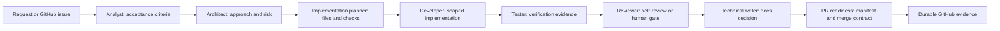

# AgentFlow SDLC in 5 minutes

AgentFlow SDLC is an open-source process layer for AI-assisted software delivery. It helps teams use AI more confidently while keeping work understandable, reviewable, resumable, and safe to ship through GitHub.

Version 1.0.0 is the current release line. Use the live release badge and status note in the [README](../README.md#release-status) to confirm GitHub availability, and read the [v1.0.0 release notes](releases/v1.0.0.md) for the complete capability set.

## The problem it solves

AI assistants can produce code quickly, but the surrounding delivery questions still matter:

- What was requested, and what was intentionally out of scope?
- Which architecture or product decisions were made?
- What validation actually ran?
- Was review independent, self-review, or human approval-gated?
- Where does a later person or agent resume if the session ends?

Without a system, those answers stay trapped in chat history. AgentFlow moves them into durable project evidence: issues, handover comments, PR bodies, commits, and validators.

## The one-sentence model

AgentFlow SDLC adds role-based workflow phases, GitHub evidence contracts, and local validators around your existing repository so humans and agents follow the same delivery rules.

## The lifecycle


```mermaid
flowchart LR
  Request["Request or GitHub issue"] --> Analyze["Analyst: acceptance criteria"]
  Analyze --> Architect["Architect: approach and risk"]
  Architect --> Plan["Implementation planner: files and checks"]
  Plan --> Build["Developer: scoped implementation"]
  Build --> Test["Tester: verification evidence"]
  Test --> Review["Reviewer: self-review or human gate"]
  Review --> Docs["Technical writer: docs decision"]
  Docs --> PR["PR readiness: manifest and merge contract"]
  PR --> GitHub["Durable GitHub evidence"]
```

## Default: one agent, clear roles

AgentFlow is **single-agent by default**. One executor can carry context end to end while switching through explicit roles: product manager, analyst, architect, implementation planner, developer, tester, reviewer, technical writer, and PR readiness.

## Intelligent collaboration when it helps

AgentFlow can use more AI intelligence without asking people to manage more agents. Clear work stays single-agent. Uncertain work can invite focused advisors. Broad work can use bounded discovery. Sensitive work keeps human approval. In every case, the parent workflow owns synthesis and leaves compact evidence.

The guiding rule is: **increase intelligence per decision, not agents per task**.

Optional multi-agent routing is available when it adds value, but it is explicit and evidenced. A multi-agent claim must show which intelligence executed which role, how it was reached, and whether review was independent.

Each role transition is also bilateral: the sending role issues acceptance criteria, the receiving
role returns a digest-bound delivery receipt, deterministic checks run first, and the sender accepts
or requests concrete rework. Complex changes can request a targeted role council, while one named
owner retains the decision. See [`role-collaboration.md`](role-collaboration.md).

Before relying on advanced planning, delegation, isolation, or structured-output features, inspect
the selected provider. AgentFlow resolves portable execution intents against what that provider
reports at runtime and records any explicit degraded fallback:

```bash
node bin/cli.mjs providers inspect claude-cli --json
node bin/cli.mjs collaboration plan --mode council --provider claude-cli --json
```

## The primary way to evaluate it

The easiest evaluation path is **LLM-assisted onboarding**, not a manual checklist. Ask an assistant to inspect your project read-only, preserve existing instructions, ask for your choices, and propose setup commands before anything changes.

Use the prompt in [`assisted-onboarding.md`](assisted-onboarding.md), or print it locally:

```bash
node bin/cli.mjs onboarding-prompt --target /path/to/your-project
```

For an existing installation, use `adopt plan` with its current profile. Both first adoption and
updates are read-only first and approval-gated before `adopt apply` writes.

## What you see vs. what AgentFlow may coordinate

| You see                       | AgentFlow may coordinate                               |
| ----------------------------- | ------------------------------------------------------ |
| A clear architecture decision | focused risk, testability, or documentation checks     |
| A readable PR summary         | structured evidence from the work session              |
| A validation result           | bounded fix/check loops                                |
| A handoff comment             | enough context for another person or agent to continue |
| A human approval gate         | review retained for consequential decisions            |

## What the evidence looks like

AgentFlow does not ask reviewers to trust a hidden agent session. A healthy run leaves:

- a GitHub issue with requirements and acceptance criteria;
- role-pass evidence summarized into a workflow-status comment;
- handover notes for phase transitions;
- validation commands and outcomes;
- a PR manifest with implementation, review, docs, and follow-up status;
- follow-up issues for useful findings that should not drift into scope.

See [`examples/simple-bugfix-flow.md`](examples/simple-bugfix-flow.md), [`examples/multi-agent-review-flow.md`](examples/multi-agent-review-flow.md), and [`examples/high-assurance-flow.md`](examples/high-assurance-flow.md).
