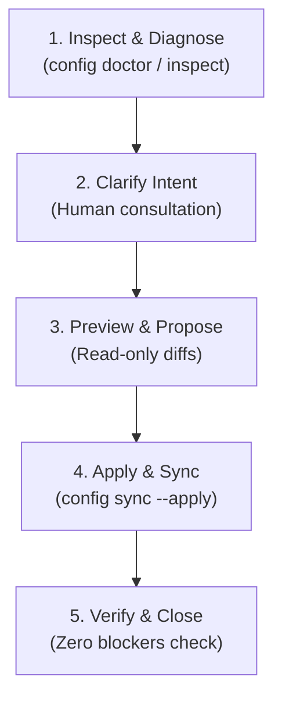

# Assisted configuration

Use this guide for continuous, day-two configuration and maintenance of **AgentFlow SDLC** in an existing project. Where [assisted onboarding](assisted-onboarding.md) gets a project initialized, this guide governs ongoing changes: tuning autonomy postures, adjusting branch strategies, updating CI validation commands, binding role methods, enabling extension packs, and synchronizing harness intelligence and adapters.

This workflow is designed for a human and an agent working in tandem, paired with the deterministic client CLI (`agentflow-sdlc config`).

## Core principle: inspect before mutate, preview before apply

Configuration changes alter how agents behave, which branches they touch, and what gates block delivery. An assisted configuration collaborator must:

1. **Never mutate blindly**: inspect current configuration and adapter drift read-only first.
2. **Clarify human intent**: ask focused, multiple-choice or direct questions instead of guessing intent.
3. **Preview exact diffs**: present proposed changes clearly before writing to disk.
4. **Synchronize atomically**: run `agentflow-sdlc config sync --apply` so skills, roles, plugins, and settings remain in lockstep.
5. **Verify health**: confirm that `agentflow-sdlc config doctor` reports zero blockers.

---

## The 5-Phase continuous configuration loop



### Phase 1: Inspect & Diagnose

Run diagnostic inspection commands in read-only mode to determine project health and identify any configuration drift:

```bash
# Comprehensive diagnostic report across authority, domain, workflow, posture, harness, and adapters
agentflow-sdlc config doctor
agentflow-sdlc config doctor --json

# Inspect effective composite configuration
agentflow-sdlc config inspect --json
```

Key facets evaluated by `config doctor`:

- **Config Authority**: verifies clean separation between domain policy (`sdlc.config.json`) and workflow settings (`agent-workflow.config.json`).
- **Workflow Configuration**: checks presence, JSON validity, and mandatory fields in `agent-workflow.config.json`.
- **SDLC Domain Policy**: validates policy shape against schema and rules.
- **Autonomy Posture Capability**: evaluates if repo tooling (tests, CI, observation fixtures) can sustain the configured posture (`interactive`, `assisted`, `delegated`, or `autonomous`).
- **Harness Intelligence**: checks configuration of the 4 pillars in `.agentflow/` (`orchestration-model.json`, `execution-policy.json`, `model-catalog.json`, `harness-parameters.json`).
- **Role & Method Catalog**: verifies role definitions and role-method bindings (e.g. TDD, event-storming).
- **Extension Packs**: checks validity of enabled extension packs.
- **Harness Adapters**: checks if skills, roles, plugins, or settings are stale and require synchronization.

### Phase 2: Clarify Intent

The agent should interview the human operator on the specific dimensions being reconfigured:

1. **Autonomy Posture**:
   - `interactive`: human executes or supervises every phase.
   - `assisted` (default): agent executes role phases with human approval for intent freeze and high-assurance gates.
   - `delegated`: agent carries work autonomously within bounded limits.
   - `autonomous`: agent executes end-to-end delivery within strict budget and policy constraints.
2. **Branch Strategy**:
   - Trunk and integration branches (e.g. `main` only vs `development` -> `main`).
   - Allowed work branch prefixes (e.g. `work/`, `feature/`, `fix/`, `chore/`).
   - Protected branches where direct edits are denied.
3. **CI Validation Commands**:
   - List of CI-equivalent test, lint, and build commands copied into PR manifests.
4. **Harness Intelligence & Sparring**:
   - Pre-code specification sparring gates.
   - Concurrency limits, execution escalation tiers, and fallback cascades.
5. **Role Routing & Methods**:
   - Preferred executors and fallbacks per role.
   - Specialist methods (e.g. TDD for developer, event storming for analyst).

### Phase 3: Preview & Propose

Formulate surgical edits to the target configuration files. Show the exact JSON diff to the human operator:

```json
// Example: Updating posture and CI commands in agent-workflow.config.json
{
  "posture": "delegated",
  "ciCommands": ["pnpm lint", "pnpm test", "pnpm build"]
}
```

Do not apply changes until the user approves the preview.

### Phase 4: Apply & Sync

Apply approved edits to configuration files. Then synchronize all local harness assets (skills, roles, plugins, and settings) in a single atomic operation:

```bash
# Preview sync actions (dry-run)
agentflow-sdlc config sync --dry-run

# Apply sync across all harnesses
agentflow-sdlc config sync --apply
```

This synchronizes:

- **Skill Adapters**: prompts and adapters for Claude Code, Pi, Agy, and Codex in `.agentflow/skills/` and harness directories.
- **Role Adapters**: phase role instructions in `.agentflow/roles/`.
- **Plugin Manifests**: harness plugins generated from current capabilities.
- **Harness Settings**: structurally merges settings into harness configuration files without overwriting user customizations.

### Phase 5: Verify & Close

Re-run the configuration doctor to confirm that all checks pass and zero blockers remain:

```bash
agentflow-sdlc config doctor
```

Report the final configuration state and summarize the changes made.

---

## Deterministic client vs Assisted agent workflow comparison

| Capability                     | Deterministic Client (CLI)                  | Assisted Agent Workflow                    |
| :----------------------------- | :------------------------------------------ | :----------------------------------------- |
| **Initial Setup**              | `agentflow-sdlc init --posture <id> --sync` | `agentflow-sdlc onboarding-prompt`         |
| **Configuration Health Check** | `agentflow-sdlc config doctor`              | Agent inspects `config doctor --json`      |
| **View Effective Config**      | `agentflow-sdlc config inspect`             | Agent reads `config inspect --json`        |
| **Adapter Synchronization**    | `agentflow-sdlc config sync --apply`        | Agent runs `config sync --apply` post-edit |
| **Guided Reconfiguration**     | Manual editing of config files              | `agentflow-sdlc config prompt`             |
| **Harness Scaffolding**        | `agentflow-sdlc harness scaffold`           | Agent scaffolds and tailors pillars        |

---

## Copy-paste agent handoff for continuous configuration

To start an assisted continuous configuration session with an agent, copy and paste this prompt:

```text
Use the AgentFlow SDLC assisted configuration guide:
https://github.com/smota/agentflow-sdlc/blob/main/docs/assisted-configuration.md

Apply it to this project. You are acting as an assisted configuration collaborator. Follow the 5-phase loop:
1. Inspect: Run `agentflow-sdlc config doctor --json` and `agentflow-sdlc config inspect --json` read-only to understand the current configuration state, posture, and any adapter drift.
2. Clarify Intent: Ask me what you want to adjust (autonomy posture, branching strategy, CI commands, role routing, adversarial sparring gates, harness intelligence, or extension packs).
3. Preview & Propose: Propose exact changes to agent-workflow.config.json, sdlc.config.json, or .agentflow/ files without mutating them until approved.
4. Apply & Sync: Once approved, apply the changes and synchronize harness adapters using `agentflow-sdlc config sync --apply`.
5. Verify: Re-run `agentflow-sdlc config doctor` to confirm all checks pass with zero blockers.
```

Or print it dynamically from your checkout:

```bash
agentflow-sdlc config prompt
```
