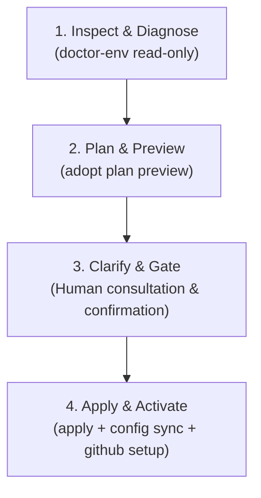

# Assisted onboarding

Use this guide when adding **AgentFlow SDLC** to an existing project. It is designed for a human and an agent to follow together: inspect first, validate read-only, ask explicit choices, propose changes, and preserve existing project instructions.

Prefer to run the commands yourself instead? [Get started](get-started.md) covers the same ground
in six commands without a conversation.

## Core rule: clarity over automation

The onboarding assistant inspects the environment and repo files, presents clear plans and trade-offs, and seeks explicit confirmation before making changes. It does not install external system tools, authenticate services, overwrite custom instructions, or modify policy without explicit approval.

## Copy-paste agent handoff

Paste this prompt into any coding agent or harness (Antigravity, Claude Code, Codex, Cursor, Pi, Omnigent, etc.) running in your project repository:

```text
You are acting as an AgentFlow SDLC assisted onboarding assistant. Follow the assisted onboarding guide:
https://github.com/smota/agentflow-sdlc/blob/main/docs/assisted-onboarding.md

Execute the 4-step onboarding protocol on this repository:
1. Inspect & Diagnose: Run environment validation read-only (`node /path/to/agentflow-sdlc/bin/cli.mjs doctor-env --target . --json`) and inspect existing instructions (AGENTS.md, README, docs, .github/). Report any missing tools or potential conflicts.
2. Plan & Preview: Run an adoption plan (`node /path/to/agentflow-sdlc/bin/cli.mjs adopt plan --profile standard --target . --json`). Summarize the plan in plain English without modifying files.
3. Clarify Choices & Gate: Ask me for approval to apply adoption, sync harness commands, and bootstrap GitHub templates. Clarify any preferred project defaults (branch strategy, CI test command).
4. Apply & Activate: Upon my confirmation, execute adoption apply, sync slash commands (`config sync --apply`), setup GitHub governance (`github setup --apply`), and run `sdlc validate` to ensure zero blockers.
```

---

## The 4-step assisted onboarding protocol



### Step 1: Inspect & Diagnose

The assistant validates repository health and tool availability in read-only mode:

```bash
node /path/to/agentflow-sdlc/bin/cli.mjs doctor-env --target /path/to/project --json
```

- Inspects existing files (`AGENTS.md`, `CLAUDE.md`, `CODEX.md`, `AGY.md`, README, `.github/`).
- Checks required tools (Node.js 20+, Git) and optional tools (`gh`, harness CLIs).
- Highlights any missing tools and directs to [`environment-tools.md`](environment-tools.md) without halting.

### Step 2: Plan & Preview

The assistant generates a non-destructive adoption plan preview:

```bash
node /path/to/agentflow-sdlc/bin/cli.mjs adopt plan --profile standard --target /path/to/project --json
```

- Checks `agent-framework-lock.json` and evaluates files to be added or managed.
- Identifies any existing user-authored content to ensure nothing is overwritten without consent.
- Summarizes the exact files to be created or modified in plain English for the human collaborator.

### Step 3: Clarify Choices & Gate (Human Confirmation)

The assistant consults the human collaborator on key project decisions before taking action:

1. **Adoption Confirmation**: Confirm readiness to proceed with the proposed plan.
2. **Project Defaults**:
   - Primary branch strategy (`trunk`, `development`, or custom feature branches);
   - CI-equivalent validation and test command (e.g. `npm test`, `pytest`, `cargo test`);
   - Desired autonomy posture (`assisted`, `delegated`, or `interactive`).
3. **Activation Options**:
   - Synchronize harness slash commands and skills (`config sync`);
   - Bootstrap GitHub issue templates, labels schema, and PR checklists (`github setup`).

### Step 4: Apply & Activate

Upon receiving human approval, the assistant runs the activation pipeline:

```bash
# 1. Apply the approved adoption plan
node /path/to/agentflow-sdlc/bin/cli.mjs adopt apply --profile standard --target /path/to/project --confirm <plan-token> --json

# 2. Activate harness slash commands and portable skills
node /path/to/agentflow-sdlc/bin/cli.mjs config sync --target /path/to/project --apply

# 3. Bootstrap GitHub governance templates and labels
node /path/to/agentflow-sdlc/bin/cli.mjs github setup --target /path/to/project --apply

# 4. Verify installation integrity
node /path/to/agentflow-sdlc/bin/cli.mjs sdlc validate --target /path/to/project
```

The assistant summarizes the outcome: files added, commands executed, and verified status.

---

## Optional CLI prompt helper

From the framework checkout, print the onboarding prompt targeting any repository:

```bash
node bin/cli.mjs onboarding-prompt
node bin/cli.mjs onboarding-prompt --target /path/to/project
```

## Ongoing configuration and maintenance

Once initial onboarding is complete, use [Assisted configuration](assisted-configuration.md) for continuous configuration, adapter synchronization, adversarial sparring gates, and posture changes.
