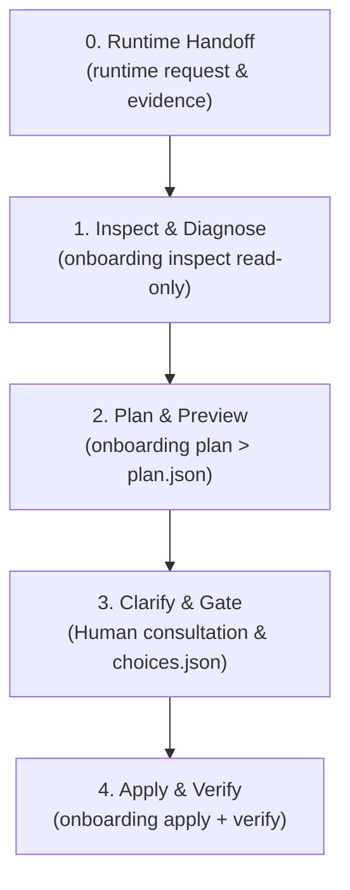

# Assisted onboarding

Use this guide when adding **AgentFlow SDLC** to an existing project. It is designed for a human and an agent to follow together: inspect first, validate read-only, ask explicit choices, propose changes, and preserve existing project instructions.

Prefer to run the commands yourself instead? [Get started](get-started.md) uses `init` for a quick path with repository detection and starter evidence.
This assisted path uses reviewed `adopt plan/apply` and explicit project configuration;
it does not automatically create the same starter run.

## Core rule: clarity over automation

The onboarding assistant inspects the environment and repo files, presents clear plans and trade-offs, and seeks explicit confirmation before making changes. It does not authenticate services, overwrite custom instructions, or modify policy without explicit approval.

## Copy-paste agent handoff

Paste this prompt into any coding agent or harness (Antigravity, Claude Code, Codex, Cursor, Pi, Omnigent, etc.) running in your project repository:

```text
You are acting as an AgentFlow SDLC assisted onboarding assistant. Follow the assisted onboarding guide:
https://github.com/smota/agentflow-sdlc/blob/main/docs/assisted-onboarding.md

Execute the onboarding protocol on this repository: /path/to/project

Principles:
- The runtime discovers and provisions tool paths using its own mechanisms; AgentFlow does not execute host installation.
- The current runtime is the default scope; extra runtimes require an explicit request.
- Always assess updates, but updating shared tools is a separate decision from adopting a project.
- Unknown outcomes must be reconciled before repeating operations.

1. Runtime & Environment Request:
   - If the CLI is missing, the runtime first provisions it through its own installation mechanism and verifies discovery; these CLI commands start after bootstrap.
   - Save runtime request: `agentflow-sdlc onboarding runtime-request > runtime-request.json`
   - The runtime writes fresh observations to runtime-evidence.json matching that request ID and runtime ID. Use schemas/onboarding-runtime.schema.json; unknown observations remain unknown.
   - Run environment diagnostics in read-only mode: `agentflow-sdlc doctor-env --target /path/to/project --json`

2. Inspect & Diagnose:
   - Inspect the project: `agentflow-sdlc onboarding inspect --target /path/to/project --json`
   - Review existing instructions (AGENTS.md, README, docs, .github/) and report any conflicts.

3. Plan & Preview:
   - Save the plan preview: `agentflow-sdlc onboarding plan --target "/path/to/project" --profile standard --runtime-request runtime-request.json --runtime-evidence runtime-evidence.json > onboarding-plan.json`
   - Summarize the plan in plain English without modifying files.

4. Clarify Choices & Gate:
   - Present the adoption preview and ask for explicit confirmation before applying.
   - Clarify project preferences if needed (branch strategy, CI test command, posture).
   - If choices or resolutions are required, provide them via a choices file.

5. Apply & Verify:
   - After approval, apply the reviewed plan: `agentflow-sdlc onboarding apply --target "/path/to/project" --plan onboarding-plan.json --confirm <digest> --runtime-evidence runtime-evidence.json`
   - Verify: `agentflow-sdlc onboarding verify --target "/path/to/project" --runtime-request runtime-request.json --runtime-evidence runtime-evidence.json --json`
   - Report projectReady and runtimeReady separately. For project-only setup omit runtime files consistently; runtime readiness then remains unverified. Readiness for a governed change requires an issue contract and actual verification evidence.
```

---

## The assisted onboarding protocol

Runtime evidence is optional for project-only setup. For a full readiness report, save
the request and pass its matching evidence through plan, apply, and verify as shown
above. Runtime observations use the [runtime schema](../schemas/onboarding-runtime.schema.json).
The runtime supplies provenance for actual CLI use and skill discovery; component
availability and release/update observations are separate. Do not fill unknown fields
with successful examples. Additional runtimes receive their own requests.

For known historical locks, select `"migrateLegacy": true` in the choices file.
For an unrecognized lock, select `"recoverUnknown": true` and disposition every
conflicting path through `"resolutions": {"path": "preserve"}` or `"replace"`.
The preview binds the old lock bytes; the receipt supports restoring them. Malformed
project configuration requires explicit repair before planning, and linked paths remain
preserved. See [ADR 009](adr/009-incremental-onboarding.md).



### Step 0: Runtime Handoff and Tooling

The connected runtime discovers and provisions tool paths using its own mechanisms; AgentFlow does not execute host installation or manage host-specific directories. The current runtime is the default scope, while additional runtimes require an explicit parameter. Emit a generic runtime request:

```bash
agentflow-sdlc onboarding runtime-request --runtime current > runtime-request.json
```

Runtime evidence is bounded data supplied back by the runtime; AgentFlow evaluates declared capabilities without executing arbitrary commands or path discovery.

### Step 1: Inspect & Diagnose

The assistant diagnoses project inventory and evaluates runtime evidence in read-only mode:

```bash
agentflow-sdlc onboarding inspect --target /path/to/project --runtime-request runtime-request.json --runtime-evidence runtime-evidence.json
```

- Inspects existing files (`AGENTS.md`, `agent-workflow.config.json`, lockfile, `.github/`).
- Checks capability status against runtime evidence.
- Identifies uncommitted or conflicted states without performing writes.

### Step 2: Plan & Preview

The assistant generates an immutable onboarding plan preview. The plan is output to stdout without modifying files; users redirect stdout to persist it:

```bash
agentflow-sdlc onboarding plan --target /path/to/project --profile standard > onboarding-plan.json
```

- Evaluates missing assets and required transformations.
- Produces an exact cryptographic plan digest.
- If explicit project configurations or conflict resolutions are needed, pass a choices JSON:

```json
{
  "config": {
    "posture": "assisted",
    "branching": {
      "trunk": "main",
      "integration": "development"
    }
  }
}
```

```bash
agentflow-sdlc onboarding plan --target /path/to/project --choices choices.json > onboarding-plan.json
```

### Step 3: Clarify Choices & Gate (Human Confirmation)

The assistant presents the plan and explains the three distinct readiness dimensions:

1. **`projectReady`**: Project adoption assets, lockfile, and configurations are present, valid, and contain no conflicts or pending journals.
2. **`runtimeReady`**: The connected runtime has demonstrated required capabilities through assessed evidence.
3. **`governedChangeReady`**: Always false during onboarding. Adoption and installation alone prove neither tests nor acceptance; a governed change requires a frozen issue acceptance contract and verified observations.

### Step 4: Apply & Verify

Upon human confirmation, apply the saved plan using its confirmation token digest and verify the result:

```bash
# 1. Apply the reviewed plan with its cryptographic digest
agentflow-sdlc onboarding apply --target /path/to/project --plan onboarding-plan.json --confirm <digest>

# 2. Verify project readiness only (runtime evidence omitted in this example)
agentflow-sdlc onboarding verify --target /path/to/project --json
```

`init` vs `onboarding plan/apply` distinction: `init` is a backwards-compatible quick starter that detects conventional branch names and test scripts for brand-new repositories while preserving existing configuration. `onboarding plan` and `onboarding apply` provide transactional, incremental adoption with explicit plan files, drift rejection, and recovery journals.

Between adoption and activation, apply the approved edits to the project-owned
`agent-workflow.config.json`: set the actual trunk/integration branches and matching
`integrationLifecycle` values, work-branch policy, `ciCommands`, and `posture`.
Preserve existing instructions and settings; surface adoption conflicts before proceeding.
Unlike `init`, `adopt apply` does not detect these values or create a starter check and
`agentflow-acceptance.json`. Existing project settings are preserved even with
`init --force`; use explicit configuration choices for changes.

Before the first governed run, configure `delivery.candidate`, `delivery.checks` and
`delivery.contracts` with an acceptance file for the actual change, following
[run operations](run-operations.md). If no test command exists, report that missing
prerequisite; installation validation alone is not evidence that a change passed tests.

`harness scaffold` seeds missing pillars; tailor them to the approved project choices.
Adapter generation is an explicit maintainer operation, separate from onboarding.
`github setup` writes local files, including `.github/labels.json`; it does not create
remote labels. Skip it for projects that do not use GitHub.

Finally run `agentflow-sdlc config doctor --target /path/to/project --json`.
Report blockers, warnings, files changed and which steps were actually verified.
Completion here means adoption and configuration; a frozen contract and recorded
observation require a subsequent run.

---

## Optional CLI prompt helper

With the CLI installed, print the onboarding prompt targeting any repository:

```bash
agentflow-sdlc onboarding-prompt
agentflow-sdlc onboarding-prompt --target /path/to/project
```

## Ongoing configuration and maintenance

Once initial onboarding is complete, use [Assisted configuration](assisted-configuration.md) for continuous configuration, adapter synchronization, adversarial sparring gates, and posture changes.
