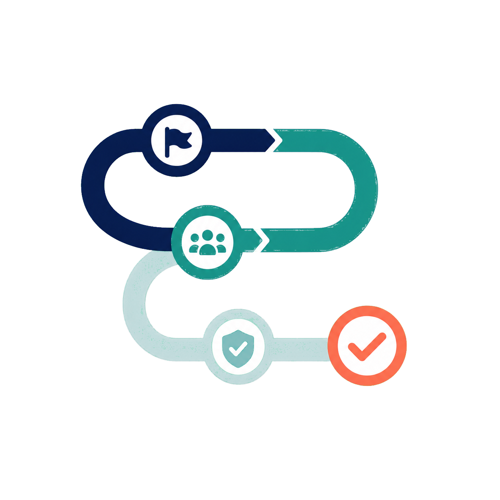
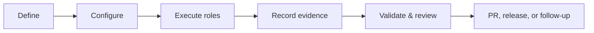

<div align="center">
  
  <br />
  
  <h1>AgentFlow SDLC documentation</h1>
  <p>Start quickly, then go as deep as your role requires.</p>
  <p>
    <a href="../LICENSE"></a>
    <a href="https://github.com/smota/agentflow-sdlc/stargazers"></a>
    <a href="https://github.com/smota/agentflow-sdlc/releases/latest"></a>
    <a href="https://github.com/smota/agentflow-sdlc/actions/workflows/validate-pr.yml"></a>
  </p>
</div>

This is the complete map of maintained product, adoption, architecture, operations, and contributor documentation. For a role-based route, use [Start here](start-here.md).

## Role routes

| Role            | Shortest maintained path                                                                   |
| --------------- | ------------------------------------------------------------------------------------------ |
| Adopter         | [Evaluate, preview, adopt, and recover](adopters/index.md)                                 |
| Maintainer      | [Protect architecture, compatibility, validation, and release truth](maintainers/index.md) |
| Provider author | [Implement and prove a capability-based provider](providers/index.md)                      |
| Operator        | [Inspect health, availability, evidence, and recovery](operators/index.md)                 |

## Getting started

| Document                                            | Use it for                                                              |
| --------------------------------------------------- | ----------------------------------------------------------------------- |
| [README](../README.md)                              | 30-second product orientation, current status, and quickest safe action |
| [Start here](start-here.md)                         | Route by audience or job                                                |
| [AgentFlow in 5 minutes](agentflow-in-5-minutes.md) | Understand the problem, model, and evidence flow                        |
| [Get started](get-started.md)                       | Follow the current source-based adoption path                           |
| [Assisted onboarding](assisted-onboarding.md)       | Give an assistant a read-only-first setup contract                      |
| [Environment tools](environment-tools.md)           | Understand required and optional tooling                                |

## Core model and governance



| Document                                                 | Authority                                                                             |
| -------------------------------------------------------- | ------------------------------------------------------------------------------------- |
| [`AGENTS.md`](../AGENTS.md)                              | Required first-read repository policy                                                 |
| [Agent workflow](agent-workflow.md)                      | Phase state machine, role-pass contract, branches, handoffs, review, and PR readiness |
| [Issue standards](issue-standards.md)                    | Issue structure, labels, lifecycle metadata, and body updates                         |
| [SDLC definition](sdlc-definition.md)                    | Portable product vocabulary and state model                                           |
| [Lifecycle roles](roles/index.md)                        | Versioned role taxonomy, ownership, authority, and handoffs                           |
| [Role methods](roles/methods.md)                         | Configurable analysis, engineering, quality, and documentation approaches             |
| [Project setup](project-setup.md)                        | Guided project decisions                                                              |
| [Project configuration](project-config.md)               | Complete `agent-workflow.config.json` contract                                        |
| [Modular architecture](modular-architecture.md)          | Core, provider, source, adoption, Cockpit, and configuration ownership                |
| [Contribution workflow](guides/contribution-workflow.md) | Repository contribution sequence                                                      |

## Evidence, lifecycle, and quality

| Document                                                                     | Use it for                                                              |
| ---------------------------------------------------------------------------- | ----------------------------------------------------------------------- |
| [Evidence contracts](evidence-contracts.md)                                  | `ArtifactRef`, transition envelope, handoff, and audit result contracts |
| [Lifecycle boundaries](lifecycle-boundaries.md)                              | External signals, proposals, action authority, and lifecycle events     |
| [Agent evals](agent-evals.md)                                                | Executable evaluation manifests and runner behavior                     |
| [Outcome metrics](outcome-metrics.md)                                        | Derive projections from evidence events without inventing claims        |
| [Provider matrix](providers/provider-matrix.md)                              | Declared provider facets and honest limitations                         |
| [GitHub source adapter](sources/github.md)                                   | Default source implementation and mutation boundary                     |
| [Simple bug-fix flow](examples/simple-bugfix-flow.md)                        | See a compact issue-to-PR evidence path                                 |
| [Multi-agent review flow](examples/multi-agent-review-flow.md)               | See explicit role attribution and independent review                    |
| [High-assurance flow](examples/high-assurance-flow.md)                       | See human security and acceptance gates                                 |
| [Intelligent-collaboration flow](examples/intelligent-collaboration-flow.md) | See smallest-sufficient collaboration and compact synthesis             |

## Runtime, routing, and collaboration

| Document                                                  | Use it for                                                                |
| --------------------------------------------------------- | ------------------------------------------------------------------------- |
| [Runtime platforms](runtime-platforms.md)                 | Registered evidence identities                                            |
| [Execution targets](execution-targets.md)                 | Distinguish launcher, executor, transport, model, and delegation boundary |
| [Agent routing](agent-routing.md)                         | Configure owners, fallbacks, and role alternation                         |
| [Capabilities](capabilities.md)                           | Resolve PLAN, WORKFLOW, LOOP, and SUB-AGENTS portably                     |
| [Intelligent collaboration](intelligent-collaboration.md) | Choose the smallest sufficient collaboration mode                         |
| [Role collaboration](role-collaboration.md)               | Define deterministic handover acceptance, rework, and councils            |

Runtime-specific references:

| Runtime        | Routing                                    | Runtime negotiation                         |
| -------------- | ------------------------------------------ | ------------------------------------------- |
| Agy            | [Agy routing](agents/agy-routing.md)       | [Provider inspection](providers/index.md)   |
| Claude Code    | [Claude routing](agents/claude-routing.md) | [Provider inspection](providers/index.md)   |
| Codex          | [Codex routing](agents/codex-routing.md)   | [Provider inspection](providers/index.md)   |
| Pi             | [Pi routing](agents/pi-routing.md)         | [Provider inspection](providers/index.md)   |
| Manual/human   | —                                          | [Provider inspection](providers/index.md)   |
| Exploratory QA | [QA expert](agents/qa-expert.md)           | [Role collaboration](role-collaboration.md) |

## Extensions and distribution

| Document                              | Use it for                                                              |
| ------------------------------------- | ----------------------------------------------------------------------- |
| [Default skills](default-skills.md)   | Skill inventory, provenance, and companion skills                       |
| [Extension packs](extension-packs.md) | Add repository-level engineering approaches and validators              |
| [SDLC packaging](sdlc-packaging.md)   | Understand source, adapters, manifests, and future package distribution |

## Cockpit operations

Cockpit is optional. CLI and GitHub evidence remain authoritative without it.

| Document                                                    | Use it for                                       |
| ----------------------------------------------------------- | ------------------------------------------------ |
| [Cockpit](cockpit.md)                                       | Goal Command Center setup and features           |
| [Cockpit concepts and rules](cockpit-concepts-and-rules.md) | Product language, safety, and support boundaries |
| [Cockpit QA](cockpit-qa.md)                                 | Operational and exploratory checks               |

## Release operations

| Document                                    | Use it for                                           |
| ------------------------------------------- | ---------------------------------------------------- |
| [Release versioning](release-versioning.md) | Plan versions, tags, approval, and closeout evidence |
| [Release publishing](release-publishing.md) | Run the maintained publication gate                  |

The current release is [v1.0.0](releases/v1.0.0.md). Published history is intentionally retained as an archive: [v0.4.0](releases/v0.4.0.md), [v0.4.1](releases/v0.4.1.md), [v0.5.0](releases/v0.5.0.md), [v0.6.0](releases/v0.6.0.md), and [v0.7.0](releases/v0.7.0.md).

## Architecture decisions

The [ADR index](adr/) records accepted, proposed, and superseded decisions. ADRs are historical decision evidence, not onboarding instructions.

## CLI and validation reference

The source CLI exposes these top-level command groups:

```text
agentflow-sdlc <doctor-env|adopt|providers|sdlc|cockpit|skills|roles|methods|plugins|settings|extensions|onboarding-prompt|release-plan>
```

Use the source checkout form until an npm package is published:

```bash
node bin/cli.mjs <command> --target /path/to/project
```

The `sdlc` group includes configuration, issue, role-pass, PR, release, skill, agent, evidence, lifecycle, eval, multi-agent, audit, migration, and metrics commands. Run an incomplete group command to print its exact usage, for example:

```bash
node bin/cli.mjs sdlc
node bin/cli.mjs skills
node bin/cli.mjs plugins
node bin/cli.mjs settings
node bin/cli.mjs extensions
```

Repository self-checks:

```bash
pnpm test
pnpm test:workflow
pnpm test:evals
pnpm format:check
node scripts/verify-hooks.mjs
node scripts/validate-npm-package.mjs
```

## Templates and implementation reference

| Surface                                       | Location                                              |
| --------------------------------------------- | ----------------------------------------------------- |
| Lifecycle role packages                       | [`roles/`](../roles/)                                 |
| Productized skill family                      | [`default-skills.md`](default-skills.md)              |
| Portable agent package                        | [`agents/agentflow-sdlc/`](../agents/agentflow-sdlc/) |
| Role pass, status, handover, and PR templates | [`agents/templates/`](../agents/templates/)           |
| Schemas                                       | [`schemas/`](../schemas/)                             |
| Validators and helpers                        | [`scripts/`](../scripts/) and [`lib/`](../lib/)       |
| Harness adapters                              | [`adapters/`](../adapters/)                           |
| Product manifests                             | [`manifests/`](../manifests/)                         |

The distributable payload and profiles are maintained in [`product-payload.json`](../manifests/product-payload.json) and [`composition-profiles.json`](../manifests/composition-profiles.json).

## Reliable delivery

- [Evidence, recovery and architecture](reliable-delivery.md)
- [Run operations and contained adoption](run-operations.md)
- [Delivery release acceptance](delivery-release-acceptance.md)
