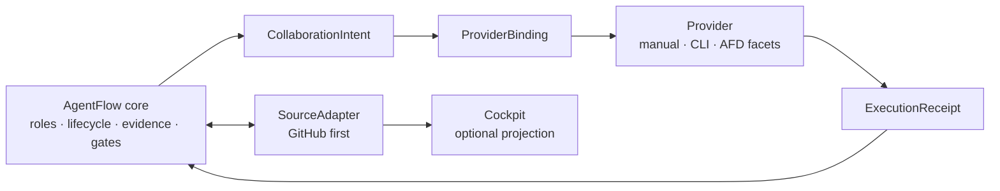

# Modular architecture

AgentFlow separates reusable SDLC policy from the systems that execute agents or store durable work.
This keeps the lifecycle usable with one agent, several providers, manual execution, or a future
source system without changing the domain model.



Text equivalent: core policy produces collaboration intent; a provider binding selects proven
execution capabilities; the provider returns a receipt using core evidence references. Source
adapters connect durable systems to core. Cockpit reads source projections and owns no unique SDLC
state.

## Responsibility matrix

| Responsibility                                                                | Owner                                                     | Not owned here                                   |
| ----------------------------------------------------------------------------- | --------------------------------------------------------- | ------------------------------------------------ |
| Roles, paths, transitions, evidence meaning, action boundaries, readiness     | AgentFlow core                                            | Provider launch mechanics                        |
| Collaboration mode, required roles, single-writer policy, fallback permission | `CollaborationIntent`                                     | Executable, model, transport, or worktree choice |
| Availability, execution target, transport, delegation, provider facets        | Provider layer                                            | SDLC lifecycle policy                            |
| Project-instruction audit, staging, apply, verification, rollback             | Optional project-harness provider such as AI Foundry Desk | AgentFlow roles or readiness                     |
| Issues, comments, pull requests, and lifecycle mutations                      | `SourceAdapter`; GitHub is first                          | Core vocabulary                                  |
| Goal and readiness visualization                                              | Optional Cockpit projection                               | Authoritative workflow state                     |
| Preview, apply, lockfile, rollback, composition profile                       | AgentFlow adoption layer                                  | Workstation or global tool management            |

## Contract boundaries

- `CollaborationIntent` is provider-neutral and always records `single-writer` policy.
- `ProviderBinding` selects by required facet, not provider name. Unavailable optional providers
  degrade to a recorded sequential/manual path only when the intent permits it.
- `ExecutionReceipt` reuses `ArtifactRef` for inputs, outputs, and validation.
- `SourceAdapter` separates reads from bounded mutations. Mutations require an explicit action
  boundary.
- Review attestations bind a decision to a SHA-256 digest. Validators detect staleness when the
  caller supplies the current candidate as `expectedDigest`; the digest comparison is not an
  automatic repository watcher.

Schemas live under `schemas/`; implementations live under `lib/core/`, `lib/providers/`, and
`lib/sources/`. Higher-level domain modules compose those contracts without owning provider or
source implementations.

## Configuration authority

`sdlc.config.json` owns domain vocabulary and policy. `agent-workflow.config.json` owns project
execution choices: branches, checks, routing, extensions, provider/source bindings, and adoption
preferences.

```bash
node bin/cli.mjs sdlc validate-authority --target /path/to/project --json
node bin/cli.mjs sdlc migrate-authority plan --target /path/to/project
```

Canonical configuration has one owner, enforced by `validate:authority` in the release and CI gate.
The explicit authority-migration preview keeps the canonical owner's value when both files define
a field, moves unambiguous misplaced values, preserves unknown keys, and requires the exact current
plan token for apply. This is a one-time cleanup tool, not runtime legacy compatibility.

## Compatibility and extraction

`minimal`, `standard`, `github`, and `cockpit` expose logical boundaries before physical npm
package splitting. `standard` is the default reusable product surface.
Retired install/update commands and v1 lockfiles are unsupported, as explicitly requested by the
product owner for this single-adopter platform. The supported path is `adopt plan -> apply -> verify`,
with a v2 lock written last and an external rollback receipt. There is no implicit legacy migration.

These are breaking changes on the unpublished issue #188 work branch. The existing package version
is not a publication approval: a separately approved release/version decision must precede any tag,
registry publication, or promotion. See [the breaking-change note](maintainers/breaking-changes.md).

See [ADRs 004–006](adr/index.md), [provider authoring](providers/authoring.md), and
[upgrade and rollback](adopters/upgrade-and-rollback.md).
