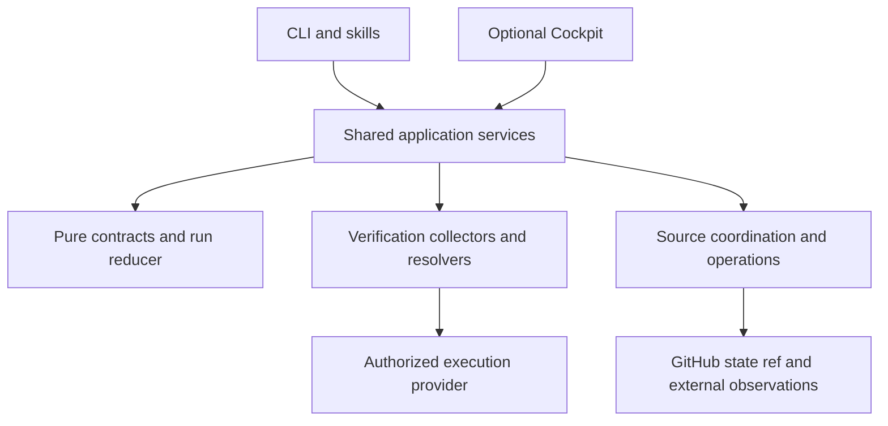

# Verifiable and recoverable delivery

These interfaces are part of the Agentflow 2.0 development work. Package and release versions remain separate from the product generation. Check the installed CLI and release notes before using a command from an unreleased checkout.

## What changes

Agentflow records three different facts: a provider executed an attempt, a collector observed a result, and an accountable role accepted a delivery. One does not imply the others. A process returning zero without the required report and assertions fails verification.

The portable core owns candidate identity, evidence policies, run events and reductions. Shared application services own acceptance, recovery and publication. Providers execute bounded work; sources persist acknowledged records. CLI and optional Cockpit read the same projections. Neither UI owns unique workflow state.

## Evidence and acceptance

`CandidateIdentity` hashes an explicit input manifest and relevant context using canonical JSON and SHA-256. Include source, dependency locks, data and relevant configuration. Do not include credentials. Undeclared dependencies remain an assurance limitation. Check definitions and acceptance policies have separate identities; changing either invalidates the old evidence.

`VerificationObservation` records producer, origin, candidate, check definition, invocation, interval, assertions and outcome. `VerificationResolution` records the result of fresh source and policy verification. Origins are `collector-observed`, `external-resolved`, `agent-reported` and `human-attested`. Deterministic acceptance accepts only the first two under the v2 contract. Semantic judgment and human authority remain separate.

The process collector allocates a fresh output directory and invocation ID. Its `structured` reporter reads `AGENTFLOW_REPORT_PATH`; the JSON must include the current `AGENTFLOW_INVOCATION_ID` and an `assertions` array of `{id,outcome}` records. The `junit-stdout` collector consumes the current process's JUnit output, including Node's native `--test-reporter=junit`, without an application-specific evidence formatter. Unsupported report shapes fail closed. Raw logs are not uploaded by default.

Local execution holds a cooperative workspace lock and fingerprints inputs before and after execution. The child receives basic executable-resolution variables, explicitly declared inherited variables, declared environment values and a project-contained temporary directory. This does not isolate an uncontrolled process or make a hostile local account trustworthy. A policy requiring immutable execution rejects cooperative observations. Never put secret values in committed `env` configuration; use authorized provider credential handling.

GitHub check observations resolve the exact repository, commit, check name and producer application ID. Pagination is bounded and incomplete responses fail. Passing CI does not imply a successful deployment or product journey.

Process observations also bind the resolved executable path and executable bytes, platform, architecture and collector runtime in an execution-context digest. The collector invokes that resolved path and checks its identity again after execution; CLI acceptance resolves it again. Replacing a runtime invalidates earlier process evidence even if source files are unchanged. This does not discover hidden child interpreters, mutable external services or undeclared dependencies; include those in the declared candidate/context or use an authoritative external observation. Preflight context digests include executable resolution and file metadata and invalidate results when those change during probes.

Before advancing, the run service verifies the frozen v2 criteria against their current authoritative source, resolves every observation, checks journey coverage, and recomputes the existing bilateral role acceptance. That acceptance must match the run's subject, candidate, phase and frozen collaboration contract identity. Open rework, changed definitions, conditional acceptance and unknown operations block progression. High-assurance review requires a host-resolved human gate at the review boundary; supplying a JSON approval claim is insufficient.

## Durable runs and recovery

Run roles remain phases 0–8. Operational status is independently `active`, `paused`, `blocked`, `completed` or `cancelled`. Local `.agent-runs/` events are preview/checkpoint artifacts and report `durable:false`. GitHub-backed runs keep acknowledged, digest-linked events on the isolated `agentflow-state` branch.

Each source mutation uses an expected run revision; the GitHub adapter serializes branch changes with single-parent, non-force updates. The state tree contains only regular `runs/<id>.json` files. Empty repositories require an explicit initial product commit. The adapter never initializes product history or changes branch protection. Before enabling it, inspect contents permission, applicable repository rules and workflow triggers for the coordination branch. A repository administrator can still alter history: content hashes detect inconsistent records, not administrator impersonation.

An external operation persists intent before submission. A connection failure becomes an unknown outcome. Reconciliation resolves the original destination and payload; a retry never blindly submits another request. Issue projections are separate versioned comments. They do not rewrite an issue or PR body and therefore preserve concurrent human edits.

Recovery rereads acknowledged source state, current workspace identity, writer status and pending operations. Its reviewed plan binds all of them. Applying it checks the same revision, resolves only verified external outcomes and records a new writer generation. It never widens the prior action boundary. Changed candidate inputs invalidate current observations. A stale executor cannot use its old generation for another Agentflow mutation.

Writer records include host, PID and instance. The local observer confirms a stopped process only when the recorded PID is absent on that host. An existing or inaccessible PID remains live or unknown, including possible PID reuse. It never deletes a lock based on age. This guard does not revoke arbitrary shell access held by another process. Cross-host transfer requires a provider capable of confirming termination; unknown support blocks recovery.

A checkpoint cannot reconstruct unpublished code. Machine-loss recovery needs an authorized pushed branch or artifact snapshot. Project-contained adoption storage likewise supports transaction recovery, not disaster backup.

## Preflight and adoption

`doctor-env --inspect` reads executable resolution and configuration without executing discovered tools. Finding a command leaves its actual capability unknown. `doctor-env --probe <profile> --execute` runs explicitly configured effects. Effects distinguish observation, project writes, network reads, provider execution and external mutation. The built-in probe CLI does not perform external mutation probes. Authentication presence never proves publishing permission. No global installation or security-setting change is implied.

Availability is `available`, `unavailable`, `unknown` or `not-required`; readiness is `runnable`, `limited` or `blocked`. Configured probes preserve executable and argument arrays, including paths with spaces. An empty successful wrapper does not demonstrate capability.

Adoption supports explicit external receipt storage or `--storage project`. Contained transactions use unique IDs under ignored `.agentflow/transactions/`, outside the managed payload. The plan includes the ignore-rule change. A flushed journal records the destination before managed writes; the receipt becomes durable before backups and the journal are removed. Cleanup failure leaves a recoverable transaction. Recovery distinguishes a completed receipt from an interrupted apply. Explicit rollback has its own durable journal and can resume after process interruption. Authored drift blocks destructive restoration.

External API callers must provide an absolute `receiptDestination`; receiving an in-memory receipt is insufficient. The CLI's `--receipt` selects that destination. Plan tokens bind preconditions and do not grant host authority. The only supported installation lock remains version 2; this change adds no migration aliases for retired formats.

## Journeys, lifecycle and budgets

Project-owned journeys link jobs to required criteria. Coverage maps them to current resolved observations and, separately, accepted and deployed candidates. Missing required coverage blocks acceptance. A non-UI change can use criteria without a synthetic UI journey.

Release, tag, merge, checks, deployment and rollback are distinct lifecycle observations. Resolve each required target against the candidate and freshness policy. A release can exist while deployment remains failed or unknown. A rollback plan is different from an exercised rollback; policy may require the latter. Agentflow does not create a monitoring scheduler.

A release requirement can set `channel: stable` or `channel: prerelease`; the default `any` accepts either. Stable requirements need an explicit observed `prerelease: false`, so an RC or unknown channel cannot satisfy them. Deployment requirements bind the exact environment target: staging evidence does not satisfy production.

Usage normalization deduplicates provider measurement IDs, converts cumulative counters into deltas within an epoch and requires a new epoch for counter resets. Preserve provider units and unknowns. Budget modes are advisory, admission-enforced and provider-enforced. Unknown usage cannot satisfy a hard admission ceiling; provider enforcement requires a real cancellation capability. Budget exhaustion requests safe stop, reconciliation and checkpointing. Costs require timestamped rates and remain estimates rather than invoices.

Run metrics expose observed attempts, passing attempts, time to first observed evidence, returned findings, recoveries and unknown operations. Report denominators and missing measurements; a small trial set does not establish statistical reliability.

## Contracts and ownership

| Contract                                                     | Version / authority                                                         |
| ------------------------------------------------------------ | --------------------------------------------------------------------------- |
| Delivery acceptance policy                                   | v2, frozen per role from the current requirement source                     |
| Candidate, observation, resolution, run event, recovery plan | v1, typed and digest-bound                                                  |
| Existing role collaboration records                          | Existing contract retained; v2 run gate additionally binds and resolves it  |
| Installation lock                                            | v2 only                                                                     |
| Human policy                                                 | `docs/sdlc-definition.md`, `docs/agent-workflow.md`, ADRs                   |
| Machine policy                                               | `sdlc.config.json` or packaged defaults, including `deliveryPolicy`         |
| Operational bindings                                         | `agent-workflow.config.json.delivery`; schema `delivery-config.schema.json` |

See [run operations](run-operations.md), [architecture decision](adr/007-verifiable-recoverable-delivery.md), and [release acceptance](delivery-release-acceptance.md).
