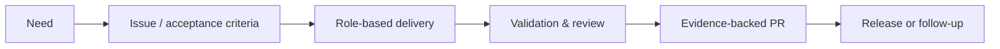

# Start here

Use this page to reach the right depth without reading the documentation front to back.

## Pick your path

| You are…                  | Start with                                 | Then use                                                                                                                  |
| ------------------------- | ------------------------------------------ | ------------------------------------------------------------------------------------------------------------------------- |
| Adopting or evaluating    | [Adopter path](adopters/index.md)          | [Get started](get-started.md), [profiles](adopters/profiles.md), and [upgrade/rollback](adopters/upgrade-and-rollback.md) |
| Maintaining AgentFlow     | [Maintainer path](maintainers/index.md)    | [Modular architecture](modular-architecture.md), [workflow](agent-workflow.md), and [ADRs](adr/)                          |
| Authoring a provider      | [Provider author path](providers/index.md) | [Provider matrix](providers/provider-matrix.md) and [authoring contract](providers/authoring.md)                          |
| Operating an installation | [Operator path](operators/index.md)        | [Troubleshooting](operators/troubleshooting.md), [Cockpit](cockpit.md), and [evidence contracts](evidence-contracts.md)   |

## The model at a glance

## New-user essentials

You only need four ideas to begin:

1. AgentFlow wraps your existing project; it does not generate or replace it.
2. One agent normally carries the work through explicit roles.
3. Issues and PRs hold durable evidence; `.agent-runs/` remains local scratch.
4. High-assurance work keeps human review before merge.

Start with the read-only command in [Get started](get-started.md#1-check-the-environment-read-only).

## Advanced-user map

| Concern                                            | Canonical document                                                                                             |
| -------------------------------------------------- | -------------------------------------------------------------------------------------------------------------- |
| Phase transitions and role-pass contract           | [Agent workflow](agent-workflow.md)                                                                            |
| Platform identity, execution target, and transport | [Runtime platforms](runtime-platforms.md) and [execution targets](execution-targets.md)                        |
| Role routing and independent review                | [Agent routing](agent-routing.md)                                                                              |
| Portable execution intents and provider inspection | [Capabilities](capabilities.md)                                                                                |
| Collaboration modes and decision budget            | [Intelligent collaboration](intelligent-collaboration.md)                                                      |
| Handover acceptance, rework, and councils          | [Role collaboration](role-collaboration.md)                                                                    |
| Artifact and lifecycle schemas                     | [Evidence contracts](evidence-contracts.md) and [lifecycle boundaries](lifecycle-boundaries.md)                |
| Extension and adapter distribution                 | [Extension packs](extension-packs.md), [default skills](default-skills.md), and [packaging](sdlc-packaging.md) |
| Lifecycle roles and configurable methods           | [Lifecycle roles](roles/index.md) and [role methods](roles/methods.md)                                         |
| Release governance                                 | [Release versioning](release-versioning.md) and [publishing](release-publishing.md)                            |
| Evals and metrics                                  | [Agent evals](agent-evals.md) and [outcome metrics](outcome-metrics.md)                                        |

For the complete categorized inventory, use the [documentation index](index.md).
