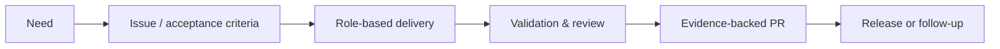

# Start here

Use this page to reach the right depth without reading the documentation front to back.

## Pick your path

| You are…                       | Start with                                               | Then use                                                                                                                 |
| ------------------------------ | -------------------------------------------------------- | ------------------------------------------------------------------------------------------------------------------------ |
| Evaluating AgentFlow           | [AgentFlow in 5 minutes](agentflow-in-5-minutes.md)      | [Get started](get-started.md) and the [examples](examples/)                                                              |
| Adding it to a repository      | [Get started](get-started.md)                            | [Assisted onboarding](assisted-onboarding.md), [project setup](project-setup.md), and [configuration](project-config.md) |
| Updating an adopted repository | [Assisted update](assisted-update.md)                    | [Release/versioning](release-versioning.md) and the [CLI reference](index.md#cli-and-validation-reference)               |
| Running issue work             | [`AGENTS.md`](../AGENTS.md)                              | The active adapter, [workflow](agent-workflow.md), [issue standards](issue-standards.md), and active issue or `SPEC.md`  |
| Designing integrations         | [SDLC definition](sdlc-definition.md)                    | [Capabilities](capabilities.md), [evidence contracts](evidence-contracts.md), and [packaging](sdlc-packaging.md)         |
| Operating visually             | [Cockpit](cockpit.md)                                    | [Cockpit concepts and rules](cockpit-concepts-and-rules.md) and [Cockpit QA](cockpit-qa.md)                              |
| Contributing to AgentFlow      | [Contribution workflow](guides/contribution-workflow.md) | [Documentation index](index.md) and [ADRs](adr/)                                                                         |

## The model at a glance

## New-user essentials

You only need four ideas to begin:

1. AgentFlow wraps your existing project; it does not generate or replace it.
2. One agent normally carries the work through explicit roles.
3. Issues and PRs hold durable evidence; `.agent-runs/` remains local scratch.
4. High-assurance work keeps human review before merge.

Start with the read-only command in [Get started](get-started.md#1-check-the-environment-read-only).

## Advanced-user map

| Concern                                            | Canonical document                                                                                             |
| -------------------------------------------------- | -------------------------------------------------------------------------------------------------------------- |
| Phase transitions and role-pass contract           | [Agent workflow](agent-workflow.md)                                                                            |
| Platform identity, execution target, and transport | [Runtime platforms](runtime-platforms.md) and [execution targets](execution-targets.md)                        |
| Role routing and independent review                | [Agent routing](agent-routing.md)                                                                              |
| PLAN, WORKFLOW, LOOP, and SUB-AGENTS               | [Capabilities](capabilities.md)                                                                                |
| Collaboration modes and decision budget            | [Intelligent collaboration](intelligent-collaboration.md)                                                      |
| Artifact and lifecycle schemas                     | [Evidence contracts](evidence-contracts.md) and [lifecycle boundaries](lifecycle-boundaries.md)                |
| Extension and adapter distribution                 | [Extension packs](extension-packs.md), [default skills](default-skills.md), and [packaging](sdlc-packaging.md) |
| Release governance                                 | [Release versioning](release-versioning.md) and [publishing](release-publishing.md)                            |
| Evals and metrics                                  | [Agent evals](agent-evals.md) and [outcome metrics](outcome-metrics.md)                                        |

For the complete categorized inventory, use the [documentation index](index.md).
